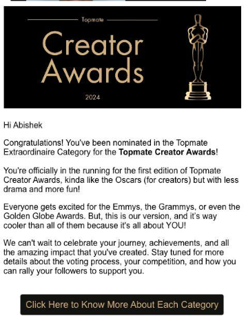
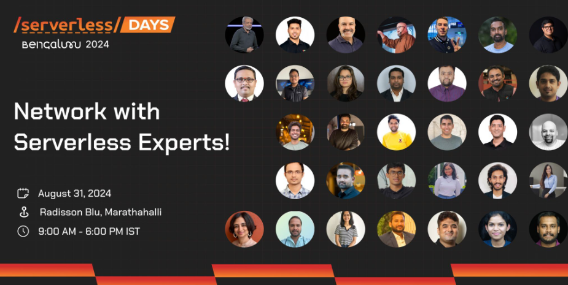

# 👋 Hi, I'm Abishek Subramanian

## 🌟 About Me

I'm a **Senior Solution Engineer** at **Databricks** with **17+ years** in cloud computing. I lead the **Databricks Community in Bangalore** and actively participate in the **AWS Bangalore Community**.

## 🏆 Certifications

I have completed the following certifications: 
- ☁️ AWS Certified Solutions Architect – Professional
- ☁️ AWS Certified Solutions Architect – Associate
- ☁️ AWS Security, Identity, and Compliance
- ☁️ AWS Solutions Training for Partners: Foundations – Technical
- ☁️ AWS Solutions Training for Partners: Machine Learning on AWS - Business 
- ☁️ AWS Solutions Training for Partners: Migrating to AWS - Technical
- ☁️ AWS Solutions Training for Partners: VMware Cloud on AWS – Technical
- ☁️ ITIL v3 (Information Technology Infrastructure Library)

- ☁️ Azure Solutions Architect Expert
- 🔍 Multiple Databricks certifications
- 💻 50+ certifications in Linux, VMware, Citrix, and Oracle

## 💼 Skills

- Customer Engagement
- Incident Management
- Engineering Management
- Cloud Strategy

## 📫 Connect with Me

---

**🌱 Passionate about cloud tech, data analytics, and community collaboration!**

Here’s a summary of the meetups and online events where I have presented, including details links and images.

## Meetups and Online Events

### 1. **ICDMAI 2025 Conference**
   - **Date:** Upcoming Event (Details to be confirmed)
   - **Event:** ICDMAI Conference
   - **Description:** Participation in sessions related to data science and AI.

   - **LinkedIn Post:** [View Here](https://www.linkedin.com/posts/icdmai_icdmai-icdmai2025-activity-7276953584796106752-NauM?utm_source=share&utm_medium=member_desktop)
---
### 2. **S4DS Event**
   - **Date:** Upcoming Event 
   - **Event:** S4DS Conference
   - **Description:** Engaging with the community on data science topics.

   - **LinkedIn Post:** [View Here](https://www.linkedin.com/posts/saptarsi-goswami-phd-93073661_icdmai-s4ds-rag-activity-7276301629631471616-bSKp?utm_source=share&utm_medium=member_desktop)
---
### 3. **Databricks & AI Workshop**
   - **Date:** 
   - **Event:** Workshop on Databricks and AI
   - **Description:** Exploring the integration of AI with Databricks technologies.

   - **LinkedIn Post:** [View Here](https://www.linkedin.com/posts/manjukaup_databricks-ai-mosaicml-ugcPost-7254721181172346880-jMyJ?utm_source=share&utm_medium=member_desktop)

---
### 4. **AWS Cloud Club SJIT!**

- **Date:** 
- **Event:** AWS Cloud Club SJIT!
- **Description:** I had the incredible honor of presenting a tech talk on "Crafting Intelligence with LLM on Databricks in AWS." I dove deep into how to run LLMs in Databricks environments for peak productivity, sparking insightful discussions and shared learning.
- **LinkedIn Post:** 
- **Images:** 

  
  
  
  

--- 
### 5. **AWS re:Invent 2023's re:Cap meetup by AWS UG Bengaluru yesterday.**

- **Date:**  March 23rd, 2024
- **Event:** AWS re:Invent 2023's re:Cap meetup by AWS UG Bengaluru yesterday.
- **Description:** I was a volunteer at the AWS re:Cap meetup conducted by AWS UG Bengaluru. I was able to meet and interact with some of the most amazing people in the AWS community. 
- **LinkedIn Post:** 
- **Images:** 

  

---

### 6. **Lets Talk Tech Episode 2**
- **Date:** 
- **Event:** Lets Talk Tech Episode 2
- **Description:** 🚀 Episode 2 of 'Lets Talk Tech' is here! 🌐 In this episode, we're diving deep into the future of data analytics with our distinguished guest, Abishek Subramanian, Senior Technical Solutions Engineer at Databricks. 🔍🔧

Abishek brings a wealth of expertise to the table, playing a pivotal role at the forefront of technological innovation in the dynamic world of data and analytics.

👤 Abishek Subramanian - A seasoned technologist, he shares his narrative, perspectives, and invaluable insights derived from his journey as a Senior Technical Solutions Engineer. Navigating the complexities of data engineering, Abishek provides solutions that drive impact and propel businesses forward.

Join us on this enlightening conversation as we explore the intersection of technology and data with Abishek Subramanian. Hit play now and be part of the 'Lets Talk Tech' journey! 🔥🚀

- **LinkedIn Post:** [View Here](https://www.linkedin.com/feed/update/urn:li:activity:7170275209013317633?utm_source=share&utm_medium=member_desktop)
- **Image:** 

  

---

### 7. **9'th World Machine Learning Summit**

- **Date:** March 21, 2024
- **Event:** 9th World Machine Learning Summit
- **Location:** Sterlings Mac Hotel Bengaluru
- **Topic:** Unlocking MLOps Potential: Streamlining Machine Learning Lifecycle with Databricks
- **Description:** Join me, Abishek Subramanian, as I explore how Databricks is revolutionizing MLOps, accelerating model development, deployment, and monitoring seamlessly.
- **LinkedIn Post:** [View Here](https://www.linkedin.com/posts/abishek-subramanian_learnwithabi-machinelearning-mlops-activity-7176416902037037056-jIR8?utm_source=share&utm_medium=member_desktop)
- **Image:** 

  

---

### 8. **Databricks Support Model Engagement**

- **Date:** March 22, 2024
- **Event:** Databricks Support Model Engagement
- **Description:** Had an insightful engagement with Shripad Joshi, Senior Director of Technical Solutions, and Divya Siruvuri, Sr. Technical Solutions Engineer for the Spark Team, Ramit Panwar, Technical Escalation Manager, at the Databricks Support Booth. Our focus was on the support model for the Data Intelligence Platform, and we went into the details of the seamless integration of technology and customer service.
- **LinkedIn Post:** [View Here](https://www.linkedin.com/posts/abishek-subramanian_databricks-dataintelligence-customerservice-activity-7177099941490647040-CV1X?utm_source=share&utm_medium=member_desktop)
- **Image:** 

  
  

---

### 9. **AWS Community Day Bengaluru 2024**

- **Date:** 
- **Event:** AWS Community Day Bengaluru 2024
- **Description:** 🌟Thrilled to recount my experiences as a volunteer during AWS Community Day Bengaluru 2024!🌟 - AWS Users Group Bengaluru
I had the incredible opportunity to be part of the AWS Users Group Bengaluru Community Day, where passion, expertise, and innovation converged to create an unforgettable experience. None of this would have been possible without the dedication and hard work of our amazing volunteers and mentors. A heartfelt thank you to each one of you: 
Bhuvaneswari Subramani, Jones Zachariah Noel N, Vivek Raja P S, Avinash Dalvi, Sridevi Murugayen, Ramya Natesan, Padmini Subramanian, Ranjinni Joshe, Omshree Butani, Ayyanar Jeyakrishnan (AJ) , Sankara Sabapathy, Hari kiran G, Ganesh Samarthyam, Jeevan Dongre.
- **LinkedIn Post:** [View Here](https://www.linkedin.com/posts/abishek-subramanian_aws-newrelic-aws-activity-7180247267642077185-tJJi?utm_source=share&utm_medium=member_desktop)
- **Image:** 

  
  
  
  
  
  

---

### 10. **Databricks Generative AI World Cup Hackathon**

- **Date:** April 15 to May 6, 2024
- **Event:** Databricks Generative AI World Cup Hackathon
- **Description:** I participated in the Databricks Generative AI World Cup hackathon from April 15 to May 6, 2024. The event provided a platform to showcase the best-quality Generative AI app for a specific industry and compete with top developers globally. It was an excellent opportunity to demonstrate skills and creativity while learning from industry experts and gaining exposure to potential employers. The hackathon offered a chance to win prizes and gain recognition for the work. To register for the hackathon, visit [here](https://lnkd.in/g9frS7f2). For helpful resources and information, check out [here](https://lnkd.in/guh4t9AG). The event helped take my Generative AI skills to the next level!
- **LinkedIn Post:** [View Here](https://www.linkedin.com/posts/abishek-subramanian_genai-databricks-aws-activity-7180477480816766976-ymyi?utm_source=share&utm_medium=member_desktop)
- **Images:** 

  

---

### 11. **Latest insights on boosting productivity for Data Engineers**

- **Date:**  May 2024
- **Event:** Dive into the world of Databricks Assistant with our latest insights on boosting productivity for Data Engineers
- **Description:** 
- **LinkedIn Post:** [View Here](https://www.linkedin.com/posts/abishek-subramanian_learnwithabi-data-databricks-activity-7201411546265116673-DSST?utm_source=share&utm_medium=member_desktop) 
[View Here](https://www.linkedin.com/feed/update/urn:li:activity:7201410494090338304?utm_source=share&utm_medium=member_desktop) 
- **Image:** 

  
  

---

### 12. **Optimizing AI Workflows: Harnessing Amazon Bedrock with Databricks Model Serving**

- **Date:** Saturday, June 29, 2024
- **Event:** Optimizing AI Workflows: Harnessing Amazon Bedrock with Databricks Model Serving
- **Description:** In the rapidly evolving landscape of artificial intelligence and machine learning, integrating powerful external models into scalable platforms is crucial for staying competitive. This session, "Harnessing the Power of External Models with Amazon Bedrock in Databricks Model Serving," offers a comprehensive exploration of how Amazon Bedrock models can be effectively deployed and served within the Databricks environment to enhance AI capabilities.
Participants will gain an in-depth understanding of Amazon Bedrock's robust features and Databricks Model Serving's dynamic infrastructure. The session will cover essential aspects such as the integration process, best practices for seamless deployment, and strategies for optimizing model performance and scalability. Through real-world case studies and live demonstrations, attendees will see firsthand the tangible benefits and performance improvements achieved by leveraging this powerful combination.
- **Speaker:** Abishek Subramanian - Databricks
- **Venue:** Nasdaq Corporate Solutions Pvt. Ltd,
- **Meetup Link:** [View Here](https://www.meetup.com/awsugblr/events/300803536/?eventOrigin=group_calendar)
- **LinkedIn Posts:** 
  - [View Here](https://www.linkedin.com/posts/ishan-nanda-1b657ba6_aws-nasdaq-ai-activity-7222956457799864320-T19x?utm_source=share&utm_medium=member_desktop)
  - [View Here](https://www.linkedin.com/posts/abishek-subramanian_awsugblr-aiml-data-activity-7217711691147399168-XPU5?utm_source=share&utm_medium=member_desktop)
  - [View Here](https://www.linkedin.com/posts/jones-zachariah-noel-n_thanks-for-joining-aws-user-group-bengaluru-ugcPost-7217227146275037186-5L33?utm_source=share&utm_medium=member_desktop)
- **Image:** 

 
 
 
 

---

### 13. **Databricks MLOps and Model Serving Endpoint**

- **Date:** July 6th, 2024
- **Event:** Databricks MLOps and Model Serving Endpoint
- **Description:** Abishek Subramanian presented an engaging session and demo on configuring and deploying model serving endpoints in Databricks.
- **LinkedIn Posts:** 
  - [View Here](https://www.linkedin.com/feed/update/urn:li:activity:7212264023856201728?utm_source=share&utm_medium=member_desktop)
  - [View Here](https://www.linkedin.com/feed/update/urn:li:activity:7216689575136481280?utm_source=share&utm_medium=member_desktop)
- **Key Highlights:**
  - **Databricks Bangalore User Group Community:** Explored our mission, activities, and networking opportunities. Kaniz Fatma delivered an engaging session on the importance of the Databricks community portal.
  - **Databricks Unity Catalog:** karthick L. shared his insights on efficiently managing and governing data assets with the Databricks Unity Catalog.
  - **Databricks MLOps and Model Serving Endpoint:** Abishek Subramanian and Amrith V presented an engaging session and demo on configuring and deploying model serving endpoints in Databricks.
  - **Special Thanks:** Sujitha Ramamoorthy for coordinating and providing incredible support, and Sundar Shankar for joining the Q&A sessions on model serving and Unity Catalog.
  - **Event Summary:** The meetup was a hub of knowledge exchange. Attendees soaked up valuable insights, exchanged ideas, and left with actionable takeaways. The feedback has been overwhelmingly positive! We also enjoyed delicious food, networking, and distributed swags to quiz winners.
- **Images:** 

  
  
  
  

---

### 14. **Topmate Creator Awards Nomination**

- **Date:** August 23
- **Event:** Topmate Creator Awards Nomination
- **Description:** I'm thrilled to announce that I've been nominated for the Topmate Extraordinaire Category in the first-ever Topmate Creator Awards! This prestigious award is akin to the Oscars, but specifically for creators, with a more fun and less dramatic atmosphere. 🎉
- **Importance:** For those familiar with the excitement surrounding the Emmys, Grammys, or Golden Globes, you understand the significance of this nomination. What makes it even more special is that it focuses on creators like myself.
- **Vote Link:** [Vote Here](https://www.linkedin.com/posts/abishek-subramanian_connections-topmatecreatorawards-voteforme-activity-7228689928061079552-VXnD?utm_source=share&utm_medium=member_desktop)
- **Images:** 

  
  
  

---

### 15. **Virtual Community Social: Deploying Scalable RAG-Based Chatbots on Databricks**

- **Date:** August 29, Thursday
- **Event:** Virtual Community Social
- **Description:** I had the opportunity to speak at the Virtual Community Social, where I presented a session on Deploying Scalable RAG-Based Chatbots on Databricks. The event aimed to bring together community members to connect, share, and engage with one another.
- **Event Link:** https://community.databricks.com/t5/events/databricks-community-social-august-29-8am-pt/ev-p/83554
- **LinkedIn Post:** https://www.linkedin.com/feed/update/urn:li:activity:7234932782488023040?utm_source=share&utm_medium=member_desktop
- **Session Topic:** Deploying Scalable RAG-Based Chatbots on Databricks
- **Session Highlights:**
  - **Meet the Community Team:** Attendees got to know the team behind the scenes and shared their thoughts, questions, and concerns.
  - **Be the First to Know:** Exclusive insights into upcoming changes and new features were shared.
  - **Special Speaker Session:** I presented a session with a demo on Deploying Scalable RAG-Based Chatbots on Databricks.
- **Databricks Community:** https://lnkd.in/gX6UH-Qm
- **Image:** 

  

---
### 16. **Five-Day International Faculty Development Program on "Full Stack Data Science with Generative AI"**

- **Date:** August 19 to August 23, 2024
- **Event:** Five-Day International Faculty Development Program on "Full Stack Data Science with Generative AI"
- **Host:** MADANAPALLE INSTITUTE OF TECHNOLOGY & SCIENCE
- **Role:** Resource Person
- **Description:** I had the pleasure of serving as a resource person during the Five-Day International Faculty Development Program on "Full Stack Data Science with Generative AI" from August 19 to August 23, 2024, hosted by the MADANAPALLE INSTITUTE OF TECHNOLOGY & SCIENCE.
- **LinkedIn Posts:**
  - https://www.linkedin.com/posts/abishek-subramanian_datascience-generativeai-fullstack-activity-7239170980797923328-ADN7?utm_source=share&utm_medium=member_desktop
  - https://www.linkedin.com/posts/dr-kusuma-s-29ab9b42_dear-all-greetings-department-of-computer-activity-7227298664317116417-8STg?utm_source=share&utm_medium=member_desktop
- **Images:** 

  
  

---

### 17. **Meta's AI Assistants Can Now Talk and See**

- **Event:** Meta's AI Assistants Can Now Talk and See
- **Description:** Meta's AI assistants have gained the ability to talk and see the world. Additionally, the company is releasing the multimodal Llama 3.2, a free model with visual skills.
- **Importance:** This development broadens the usefulness and relevance of Meta's AI models for robotics, virtual reality, and AI agents. Some versions of Llama 3.2 are optimized to run on mobile devices, enabling the creation of AI-powered apps that can utilize a smartphone's camera or screen to perform tasks on behalf of users.
- **Links:**
  - Post: [Link](https://www.linkedin.com/posts/abishek-subramanian_metas-ai-assistants-can-now-talk-and-see-activity-7244766964458385408-un0A?utm_source=share&utm_medium=member_desktop)
  - **Meta Releases Llama 3.2—and Gives Its AI a Voice:** https://lnkd.in/gjsvFsdg
  - **Llama 3.2 Collection:** https://lnkd.in/g4_FHnwV

- **Image:** 

  

---

### 18. **ServerlessDays Bengaluru Tech Talk**

- **Date:** August 31, 2024
- **Event:** ServerlessDays Bengaluru Tech Talk
- **Location:** Radisson Blu, Bengaluru
- **Description:** I had the privilege of presenting a tech talk at ServerlessDays Bengaluru, where I spoke on "Boosting Productivity and Simplifying Workloads with Databricks Serverless SQL." The event's energy and enthusiasm still resonate with me! 💡
- **Topic:** The talk delved into how Databricks Serverless SQL is empowering businesses with cloud-native analytics, scalability, and cost-efficiency.
- **LinkedIn Posts:**
  - [ServerlessDays Bengaluru Post](https://www.linkedin.com/posts/serverlessdays-bengaluru_serverlessdaysblr2024-datarevolution-blrtech-ugcPost-7235574303268741120-RjTl?utm_source=share&utm_medium=member_desktop)
  - [ServerlessDays Bengaluru Event Post](https://www.linkedin.com/posts/serverlessdays-bengaluru_techevent-bangalore-bangaloretech-ugcPost-7234479690013429760-26Qm?utm_source=share&utm_medium=member_desktop)
  - [My LinkedIn Post](https://www.linkedin.com/posts/abishek-subramanian_techtalk-epamsystems-epamindia-activity-7253320524364226560-NI4D?utm_source=share&utm_medium=member_desktop)
- **Images:** 

  
  
  
  
  
  
  
  

---

### 19. 🚀 Unleash the Power of Databricks Compute! 🚀

Databricks offers cutting-edge compute solutions for data engineering, science, and analytics workflows. Key features include:

* Interactive Compute for on-demand resources
* Jobs Compute for automation and scaling
* All-Purpose Compute for provisioned resources
* SQL Warehouses for elastic compute power

The Databricks Runtime powers these features, offering:

* Delta Lake for ACID transactions
* Pre-installed libraries and system integration
* GPU support and seamless platform integration

Databricks is ideal for complex ETL pipelines, real-time data processing, and ML model training. Explore how Databricks can transform your data journey!

October 19, 2024
"I've used Databricks for 2.5 years, and it's revolutionized my data processing and analytics. The platform's scalability, security, and collaborative environment make it perfect for data teams. I've seen significant productivity and efficiency improvements, and I highly recommend Databricks for anyone looking to take their data analytics to the next level."

**LinkedIn Posts:**

- [Databricks and Big Data Post](https://www.linkedin.com/posts/abishek-subramanian_databricks-bigdata-datascience-activity-7254162601809457152-k90P?utm_source=share&utm_medium=member_desktop)
- [Connections and Activity Post](https://www.linkedin.com/posts/abishek-subramanian_connections-activity-7253457621041496067-oEVG?utm_source=share&utm_medium=member_desktop)

  
  

---

### 20. Advanced Security and Governance: We dove deep into managing AI workflows securely in Databricks and Mosaic AI Gateway, ensuring data protection at every level.

- **Date:** 05th Oct 2024
- **Event:** Databricks Bangalore User Group Meetup hosted by EPAM Systems
- **Description:** I have participated in the meetup, focusing on cutting-edge AI and data engineering advancements. He highlighted a session on "Advanced Security and Governance," exploring secure management of AI workflows in Databricks and Mosaic AI Gateway, emphasizing comprehensive data protection strategies.
- **LinkedIn Posts:**
  - [View Here](https://www.linkedin.com/posts/abishek-subramanian_databricks-mosaicml-epamsystems-activity-7256216983195508736-SxFx?utm_source=share&utm_medium=member_desktop)
  - [View Here](https://www.linkedin.com/posts/manjukaup_databricks-ai-mosaicml-ugcPost-7254721181172346880-jMyJ?utm_source=share&utm_medium=member_desktop)
  - [View Here](https://www.linkedin.com/posts/abishek-subramanian_databricks-mosaicml-ai-activity-7247984182881071105-NSf4?utm_source=share&utm_medium=member_desktop)
- **Images:**

  
  
  

---

### 21. Mastering Generative AI: Building and Serving Models with Databricks

I delivered an insightful session titled "Mastering Generative AI: Building and Serving Models with Databricks" at a recent event. The presentation showcased his expertise in generative AI and Databricks, offering valuable knowledge to attendees on model development and deployment strategies.

- **Date:** 9th Nov 2024
- **Event:** Mastering Generative AI: Building and Serving Models with Databricks
- **Description:** Abishek's session provided attendees with valuable insights on generative AI and Databricks, focusing on model development and deployment strategies.
- **LinkedIn Posts:**
  - [View Here](https://www.linkedin.com/feed/update/urn:li:activity:7261347847105597440?utm_source=share&utm_medium=member_desktop)
  - [View Here](https://www.linkedin.com/posts/abishek-subramanian_databricks-bangalore-generativeai-activity-7260834104957427712-gqZM?utm_source=share&utm_medium=member_desktop)
- **Community Post:** [View Here](https://community.databricks.com/t5/bangalore/databricks-bangalore-user-group-community-meetup-at-bangalore/ec-p/95585)

**Images:**

  
  

---

### 22. **TechXConf 2024 Presentation**

- **Date:** November 15th 
- **Event:** TechXConf, Asia's Largest AI and cloud conference
- **Description:** Abishek delivered a compelling presentation at TechXConf, drawing an impressive audience of over 300 attendees. His expertise and insights on artificial intelligence were highly valued.
- **LinkedIn Posts:**
  - [Abishek's Post](https://www.linkedin.com/posts/abishek-subramanian_connections-genai-techxconf2024-activity-7279920148390596608-2vZC?utm_source=share&utm_medium=member_desktop)
  - [TechXConf Post](https://www.linkedin.com/posts/techxconf_techxconf2024-ai-cloudcomputing-activity-7253013137472331776-hEWx?utm_source=share&utm_medium=member_desktop)
  - [TechXConf Post](https://www.linkedin.com/posts/techxconf_generativeai-databricks-techinnovation-activity-7263116214422417410-G_g3?utm_source=share&utm_medium=member_desktop)
- **Speaker Profile:** [View Here](https://techxconf.com/speakers/abishek-subramanian-2024)

**Images:**

  
  
  
  
  
  
  
  

---

### 23. Data Pipelines on AWS Databricks
- **Description:** Abishek led a highly successful pre-conference workshop at ICDMAI on December 21-22, 2024. His session on "Data Pipelines on AWS Databricks" attracted over 500 eager participants from across the country, demonstrating the widespread interest in his expertise on cloud-based data solutions.
- **Date:** December 21-22, 2024 
- **LinkedIn Posts:**
  - [Abishek's Post](https://www.linkedin.com/posts/abishek-subramanian_datascience-ai-rag-activity-7279934161375608832-kcFT?utm_source=share&utm_medium=member_desktop)
  - [ICDMAI Post](https://www.linkedin.com/posts/icdmai_icdmai-icdmai2025-activity-7276953584796106752-NauM?utm_source=share&utm_medium=member_desktop)
  - [ICDMAI Post](https://www.linkedin.com/posts/saptarsi-goswami-phd-93073661_icdmai-s4ds-rag-activity-7276301629631471616-bSKp?utm_source=share&utm_medium=member_desktop)
  - [ICDMAI Post](https://www.linkedin.com/posts/manjukaup_databricks-ai-mosaicml-ugcPost-7254721181172346880-jMyJ?utm_source=share&utm_medium=member_desktop)

**Images:**

  
  
  

---

### ✍️ Random Dev Quote

